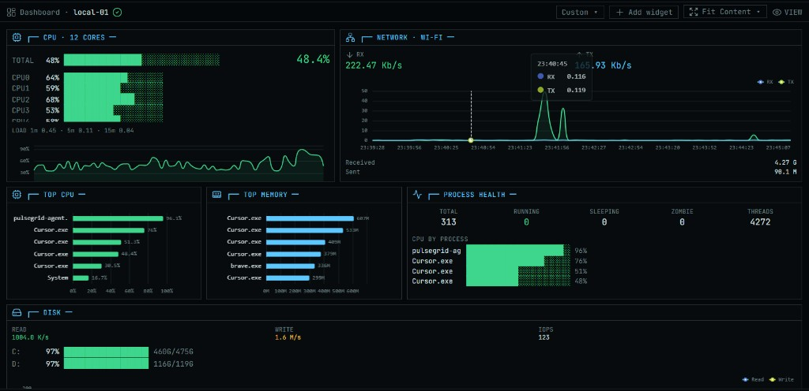

# Pulsegrid

Live fleet metrics: **agents dial Monitor** over TLS gRPC → Spring Boot + Timescale + Next.js.

**Install guide:** [docs/INSTALL.md](docs/INSTALL.md) · **Status:** [docs/STATUS.md](docs/STATUS.md) · **Latest Monitor:** [v2.3.3](https://github.com/SokmeanKao/Pulsegrid/pkgs/container/pulsegrid-monitor)



## What's new in v2.3.3

- **Auto Gateway TLS** — empty cert volume is fine; Spring generates CA/server PEMs on first start
- Default HTTP **8080** (avoids Windows :80 lock); export CA with `docker compose cp monitor:/certs/ca.crt ./ca.crt`

## What's new in v2.3.0

- **One Monitor image/container** — UI + API + Agent Gateway together (`pulsegrid-monitor`)
- Compose is only **db + monitor** (no separate dashboard/nginx containers)

## What's new in v2.2.1

- **nginx edge** — UI + API + WebSocket on one HTTP port (`80`); agents still use `:50051`
- Fixes host port clashes (e.g. `:3000` already allocated)

## What's new in v2.2.0

- **No-clone Monitor install** — pull `pulsegrid-backend` + `pulsegrid-dashboard` from GHCR
- Dashboard runtime config (works for any `--public-host` without rebuild)
- `docker-compose.monitor.yml` + `install-monitor-images.sh` / `.ps1`

## What's new in v2.1.0

- **Docker** widget — engine status, counts, top containers by CPU/mem
- **Host** widget — uptime + load averages
- **Sensors** widget — NVIDIA GPU + temps when available
- Graceful degrade when Docker/GPU/sensors are absent

## What's new in v2.0.0

**Breaking:** agents initiate the connection. `AGENTS=` and inbound agent `:50051` are gone.

- **Agent Gateway** on Monitor `:50051` (TLS, LAN CA)
- Agents dial Monitor with `--monitor` / `--token` / `--ca`
- **Add Agent** UI generates a join token + install command
- Runtime registry — hosts appear when they connect (no backend restart)
- Reconnect with exponential backoff; registered hosts reconnect without a new token
- Docs/installers rewritten for the agent-initiated model

Also from v1.3.x: terminal dashboard, layout profiles (Compact / Normal / Show More), per-widget fullscreen, themes & locales.

## Two installables

| Package | What it is | Where it runs |
|---|---|---|
| **Pulsegrid Monitor** | DB + backend + UI + **Agent Gateway :50051 (TLS)** | Ops server / your laptop (Docker) |
| **Pulsegrid Agent** | Metrics collector (**dials** Monitor) | Each machine you want to watch |

```text
Agent (outbound TLS) ──► Monitor Gateway :50051 ──► Timescale + WebSocket UI
```

---

## Install Monitor

**No clone (recommended)** — one image, HTTP **8080** + Agent Gateway **50051**. Full steps: **[docs/INSTALL.md](docs/INSTALL.md)**.

```bash
mkdir -p pulsegrid-monitor && cd pulsegrid-monitor
curl -fsSL https://raw.githubusercontent.com/SokmeanKao/Pulsegrid/main/docker-compose.monitor.yml -o docker-compose.yml
cat > .env <<'EOF'
GATEWAY_ADVERTISE_HOST=YOUR_LAN_IP
HTTP_PORT=8080
GATEWAY_PORT=50051
PULSEGRID_VERSION=v2.3.3
PULSEGRID_IMAGE_OWNER=sokmeankao
EOF
docker compose pull && docker compose up -d
docker compose cp monitor:/certs/ca.crt ./ca.crt
```

Windows installer:

```powershell
irm https://raw.githubusercontent.com/SokmeanKao/Pulsegrid/main/scripts/install-monitor-images.ps1 -OutFile $env:TEMP\pg-mon.ps1
powershell -ExecutionPolicy Bypass -File $env:TEMP\pg-mon.ps1 -PublicHost YOUR_LAN_IP -Version v2.3.3
```

| URL | Purpose |
|---|---|
| `http://YOUR_LAN_IP:8080/terminal/` | Dashboard |
| `http://YOUR_LAN_IP:8080/healthz` | Health |
| `YOUR_LAN_IP:50051` | Agent Gateway (TLS) |

---

## Install Agent

1. Export Monitor CA: `docker compose cp monitor:/certs/ca.crt ./ca.crt`
2. UI **+ Add Agent** (or `POST /api/agents/enroll`) → copy token
3. On the agent host:

**Linux:**

```bash
curl -fsSL https://raw.githubusercontent.com/SokmeanKao/Pulsegrid/main/scripts/install-agent.sh \
  | sudo bash -s -- \
      --server-id kali-01 \
      --monitor YOUR_LAN_IP:50051 \
      --token pg_join_xxxxx \
      --ca /path/to/ca.crt \
      --version v2.3.3
```

**Windows:** download `pulsegrid-agent-windows-amd64.exe` from [Releases](https://github.com/SokmeanKao/Pulsegrid/releases), then:

```powershell
$env:SERVER_ID = "win-01"
$env:MONITOR_ADDRESS = "YOUR_LAN_IP:50051"
$env:JOIN_TOKEN = "pg_join_xxxxx"
$env:MONITOR_CA_FILE = "C:\path\to\ca.crt"
.\pulsegrid-agent-windows-amd64.exe
```

Details: [docs/INSTALL.md](docs/INSTALL.md) · [agent/README.md](agent/README.md).

---

## Layout

- `proto/` — shared `monitoring.proto` (`AgentGateway.Connect`)
- `agent/` — Go agent (gRPC **client**)
- `backend/` — Spring Boot gateway + WS fan-out
- `dashboard/` — Next.js live UI
- `certs/` — generated locally (gitignored); CA + gateway server cert
- `scripts/install-monitor.sh` / `install-agent.sh` — installers

## Local development

```powershell
.\scripts\generate-monitor-certs.ps1 -PublicHost localhost
copy .env.example .env
docker compose up -d --build
```

Agent (separate terminal):

```powershell
.\scripts\build-agent.ps1
# Enroll via UI or: POST http://localhost:8080/api/agents/enroll
.\scripts\run-agent.ps1 -ServerId local-01 -Monitor localhost:50051 -Token pg_join_... -CaFile .\certs\ca.crt
```

Dashboard only:

```powershell
cd dashboard
$env:NEXT_PUBLIC_WS_URL="ws://localhost:8080/ws/metrics"
$env:NEXT_PUBLIC_API_URL="http://localhost:8080"
npm run dev
```

## Proto regeneration (Go)

```powershell
protoc --proto_path=proto `
  --go_out=agent/internal/pb --go_opt=paths=source_relative `
  --go-grpc_out=agent/internal/pb --go-grpc_opt=paths=source_relative `
  proto/monitoring.proto
```

## Design / plan

- **v2.0 gateway:** `docs/superpowers/specs/2026-09-14-pulsegrid-agent-initiated-gateway-design.md`
- **Plan:** `docs/superpowers/plans/2026-09-14-pulsegrid-agent-initiated-gateway.md`
